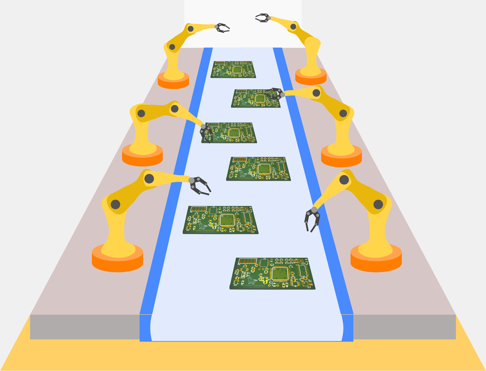
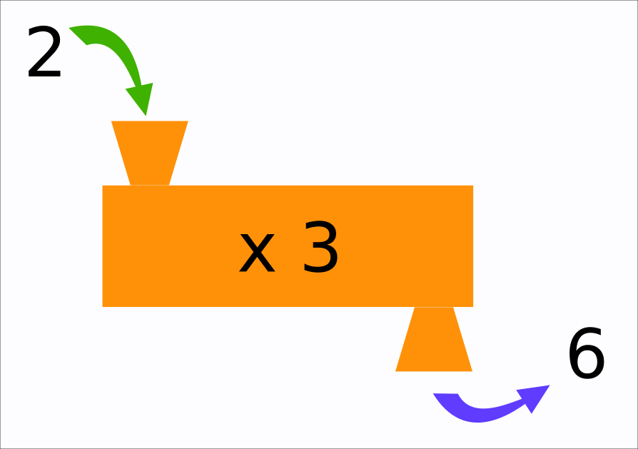

## Coding 101

### Automation

Coding helps us automate tasks. No matter who you are, an engineer, a doctor, a nurse, a teacher, a scientist, a philospher, a home maker, anybody can use coding to do mundane tasks. This helps us be more efficient and frees up our time for something more fun we would rather do.



Fun fact: [Moore's law](https://en.wikipedia.org/wiki/Moore%27s_law) states that computer power double every two years. Yet we find the computer's today still too slow to do the tasks we want them to perform!

### Functions

A computer program is a set of instructions for the machine to perform. Functions are the building blocks in a computer program. They are like Lego bricks you can use to build something big.

In middle school you might have done functions in Math class. A function is basically a machine that takes some inputs, does some operation on those inputs, and returns some output.

Take the example of a laundry machine. You put dirty clothes in it (the input), you run the machine, and you get clean clothes (the output).

Functions in coding are similar.




### Python

Python is one of the easiest programming language, and there are many more that are pretty dense. Python is generally used by people who are not programmers, so let's start with some Python code.

```
def multiply(x):
    return x * 3
```

Above we have a function definiton. The input can be anything, denoted by x. The output will be x times 3.

```
def multiply(x):
    return x * 3

multiple(2)
```

We added a *call* to our function. This is same thing as running the machine. We are asking it to take input 2 and perform the operation.

But what about the output?

```
def multiply(x):
    return x * 3

y = multiple(2)
```

Now the output is stored in y. 

Great. Next we can print the value of our output to see if it worked.

```
def multiply(x):
    return x * 3

y = multiple(2)
print(y)
```

Now print() is a built in function and we didn't need to define it. It basically prints whatever is in between the parentheis on to your screen. How it does that, at this point, we don't care. It just does it and we didn't have to define print().


At this point, try out running your own Python code. There are many online Python editors. [Try this one](https://replit.com/languages/python3) or search for another.

Try writing a function that adds 3, and *call* your function, then print its value.

**Important Tips**

In Python, indentation is important. If you don't indent a line of code, the program will not run. Note the line starting with *def* has no indentation. The later lines are indented by one tab. Any lines tabbed this way are part of the function. Any lines not indented, are not part of the function